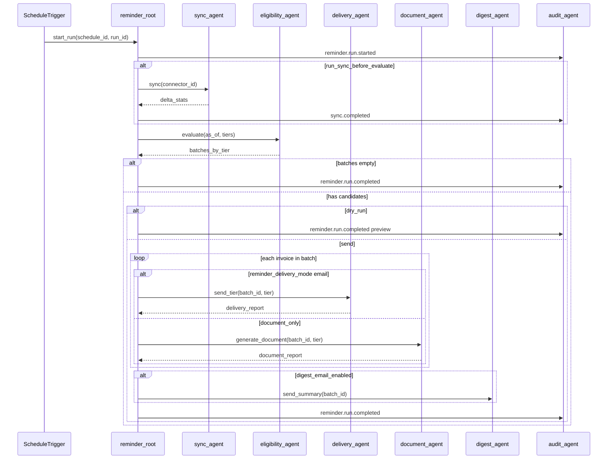
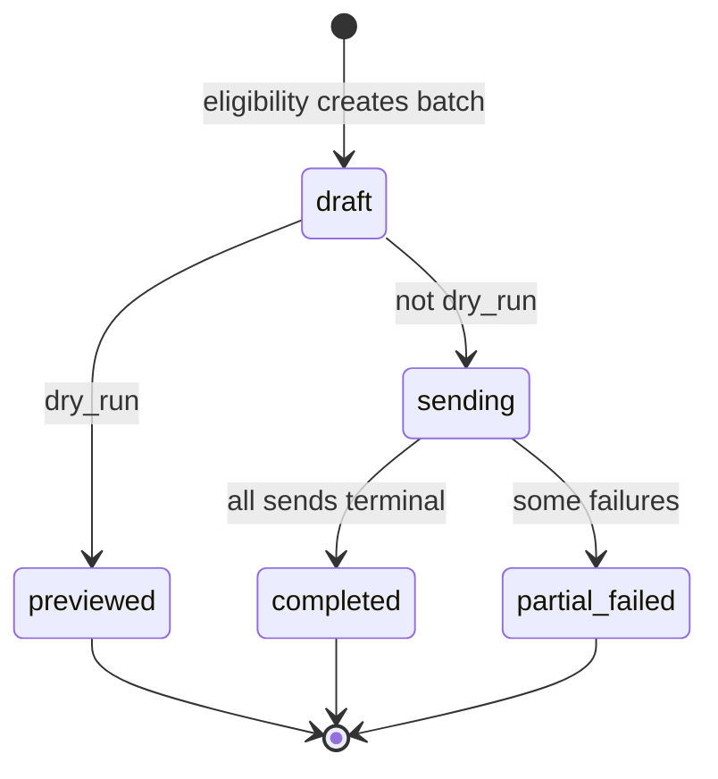

# Reminder Notification Agent

## Orchestration specification

| Field | Value |
|-------|-------|
| **Agent ID** | `reminder-root` |
| **Version** | 1.2 |
| **Last updated** | 2026-06-04 |
| **Purpose** | Top-level orchestration: sync → tier eligibility → email **or** notification documents → optional digest → audit. **Email only** (no SMS). BullMQ / NestJS in `apps/worker`. |
| **Related docs** | [PRD](../product/PRD.md) · [Engineering Standards](../engineering/standards.md) · [Agent Skills](skills.md) |

---

## 1. Mission

On each **schedule trigger** (or manual run):

1. Optionally **sync** data from configured connectors (delta via `content_hash`).
2. **Evaluate** invoices for the **next** overdue tier (sequential tier-once; default tiers 15, 30, 45, 60).
3. **Send** tier-specific emails to eligible customers (email channel only in v1).
4. Optionally send **vendor digest** when `digest_email_enabled`.
5. **Record** audit events; update `notification_number` and `last_tier_sent` when the provider accepts/sends the email.

### Invariants

| ID | Rule |
|----|------|
| INV-01 | Never send email if `email_opt_out = true` (email mode only) |
| INV-02 | Never send if `status` is `paid` or `closed`, or `balance_due <= 0` |
| INV-03 | Never send if `send_reminder = false` |
| INV-04 | Never send if `consent_email = false` |
| INV-05 | Never send tier `t` if `last_tier_sent >= t`; never skip first tier when `days_behind >= min(tier)` and no prior send |
| INV-06 | At most one notification per `(invoice_number, tier)` per deployment; one tier per invoice per run |
| INV-07 | Sub-agents must be idempotent under the same idempotency key |

---

## 2. Sub-agents

Sub-agents are **worker job handlers** (not separate Cursor agents).

| Sub-agent ID | Responsibility | Skills |
|--------------|----------------|--------|
| `sync-agent` | Excel/API/DB ingest; delta upsert | [skill-import-excel](skills.md#skill-import-excel), [skill-api-sync](skills.md#skill-api-sync), [skill-db-connector-sync](skills.md#skill-db-connector-sync) |
| `eligibility-agent` | Build tier batches (next-tier rule) | [skill-eligibility-evaluator](skills.md#skill-eligibility-evaluator), [skill-compliance-opt-out](skills.md#skill-compliance-opt-out) |
| `delivery-agent` | Send emails (`reminder_delivery_mode = email`) | [skill-send-email](skills.md#skill-send-email), [skill-compliance-opt-out](skills.md#skill-compliance-opt-out) |
| `document-agent` | PDF + HTML (`document_only`) | [skill-generate-notification-document](skills.md#skill-generate-notification-document) |
| `digest-agent` | Post-run vendor summary (optional) | [skill-vendor-digest](skills.md#skill-vendor-digest) |
| `audit-agent` | Structured events | [skill-audit-logger](skills.md#skill-audit-logger) |

**Trigger entry:** [skill-schedule-runner](skills.md#skill-schedule-runner) enqueues `reminder-root` with `{ schedule_id, run_id }`.

---

## 3. Orchestration flow



### 3.1 Batch lifecycle state machine



---

## 4. Root agent procedure

```
function run_reminder_pipeline(schedule_id, run_id):
  schedule = load_schedule(schedule_id)
  vendor = load_vendor_settings()
  audit("reminder.run.started", { schedule_id, run_id })

  if schedule.dry_run:
    dry_run_mode = true

  if schedule.run_sync_before_evaluate and vendor.connector_configured:
    result = delegate("sync-agent", { run_id })
    audit("sync.completed", result.stats)
    if result.fatal_error:
      audit("reminder.run.failed", result.error)
      return FAIL

  as_of = now(vendor.timezone)
  batches = delegate("eligibility-agent", {
    as_of,
    tiers: vendor.overdue_tiers
  })

  if batches.is_empty:
    audit("reminder.run.completed", { reason: "no_eligible" })
    return SUCCESS

  batch = create_batch(batches, schedule_id, run_id)

  if dry_run_mode:
    audit("reminder.run.completed", { reason: "dry_run", preview: batch.summary })
    return SUCCESS

  for each (invoice, tier) in batch.items_ordered():
    template_id = "reminder_tier_" + tier
    if invoice.reminder_delivery_mode == "email":
      report = delegate("delivery-agent", {
        batch_id: batch.id, invoice_id: invoice.id, tier, template_id,
        idempotency_key: f"send:{invoice.id}:{tier}:{run_id}"
      })
      audit("reminder.tier.sent", { tier, channel: "email", stats: report.stats })
    else if invoice.reminder_delivery_mode == "document_only":
      report = delegate("document-agent", {
        batch_id: batch.id, invoice_id: invoice.id, tier, template_id,
        idempotency_key: f"doc:{invoice.id}:{tier}:{run_id}"
      })
      audit("reminder.tier.document", { tier, stats: report.stats })

  if vendor.digest_email_enabled:
    delegate("digest-agent", { batch_id: batch.id })

  audit("reminder.run.completed", { batch_id: batch.id })
  return SUCCESS
```

---

## 5. Delegation contract

Every sub-agent invocation includes:

```json
{
  "parent_agent": "reminder-root",
  "run_id": "uuid",
  "schedule_id": "uuid",
  "idempotency_key": "string",
  "correlation_id": "uuid",
  "dry_run": false
}
```

Sub-agents return:

```json
{
  "status": "success | partial | failed",
  "stats": {},
  "errors": []
}
```

Idempotency keys (see [standards §10.2](../engineering/standards.md#102-idempotency-keys)):

| Action | Key pattern |
|--------|-------------|
| Schedule run | `schedule_run:{schedule_id}:{run_id}` |
| Tier send | `send:{invoice_id}:{tier}:{run_id}` |
| Document generate | `doc:{invoice_id}:{tier}:{run_id}` |
| Connector sync | `sync:{connector_id}:{run_id}` |

---

## 6. Sub-agent specifications

### 6.1 sync-agent

- Run connector or no-op if import-only deployment.
- Apply [skill-db-connector-sync](skills.md#skill-db-connector-sync) or accept pre-imported data.
- Must not send customer email.

### 6.2 eligibility-agent

- For each open invoice, compute `days_behind` in vendor timezone from `due_date`.
- **Next tier** = `min{t in tiers | days_behind >= t and (last_tier_sent is null or t > last_tier_sent)}`.
- At most **one tier per invoice** per evaluation run.
- Apply [skill-compliance-opt-out](skills.md#skill-compliance-opt-out) and `consent_email` checks.
- Group results by tier for batch creation.

### 6.3 delivery-agent

- For each invoice in tier batch:
  1. Re-check INV-01 through INV-06 (race-safe).
  2. Render template `reminder_tier_{tier}`.
  3. Send via email provider with List-Unsubscribe.
  4. On provider accept/send: `notification_number += 1`, `last_tier_sent = tier`, `last_reminder_sent_at = now`.
- Partial failure → `batch.status = partial_failed`; failed rows logged for manual retry.

### 6.4 digest-agent

- When `digest_email_enabled`, after customer sends complete, email vendor users run summary ([PRD §12](../product/PRD.md#12-vendor-digest-optional)).
- Non-blocking; does not affect customer send timing.

### 6.6 audit-agent

- Called by root and sub-agents for events in [PRD §15.3](../product/PRD.md#153-audit-log-required-v1).
- Never log raw email or phone; use `invoice_id`.

---

## 7. Event catalog

| Event | Emitter | Payload (minimal) |
|-------|---------|-------------------|
| `reminder.run.started` | root | `schedule_id`, `run_id` |
| `sync.completed` | sync-agent | `inserted`, `updated`, `skipped_unchanged` |
| `reminder.batch.created` | eligibility-agent | `batch_id`, `counts_by_tier` |
| `reminder.tier.sent` | delivery-agent | `tier`, `sent`, `failed` |
| `document.generated` | document-agent | `invoice_id`, `tier`, `pdf_storage_key` |
| `document.failed` | document-agent | `invoice_id`, `tier`, `reason` |
| `email.sent` | delivery-agent | `invoice_id`, `tier`, `template_version` |
| `email.failed` | delivery-agent | `invoice_id`, `reason` |
| `email.opt_out` | compliance | `invoice_id` or `email` |
| `reminder.digest.sent` | digest-agent | `batch_id`, `recipient_count` |
| `reminder.run.completed` | root | `batch_id`, `duration_ms` |
| `reminder.run.failed` | root | `error_code` |

---

## 8. Failure handling

| Failure | Action |
|---------|--------|
| Sync partial errors | Continue with valid rows; include errors in vendor report |
| Sync auth failure | Fail run; alert; no sends |
| Eligibility computation error | Fail run; alert |
| Email transient error | Retry per provider policy (max 5) |
| Email permanent error | Mark failed; do not increment `notification_number` |
| Duplicate idempotency key | Return previous result; no duplicate send |

---

## 9. Human-in-the-loop

| Gate | Default | Config |
|------|---------|--------|
| Per-client reminder | **On** | `send_reminder` per invoice |
| Per-client opt-out | **Off** | `email_opt_out` |
| Dry run | **Off** | `schedule.dry_run` |
| Vendor digest | **Off** | `digest_email_enabled` |

Manual triggers (document in deployment README):

```bash
# Preview eligibility without send
pnpm worker:run --schedule=<id> --dry-run=true

# Force sync then evaluate
pnpm worker:run --schedule=<id> --sync=true
```

---

## 10. Environment variables

| Variable | Purpose |
|----------|---------|
| `DATABASE_URL` | PostgreSQL |
| `REDIS_URL` | BullMQ |
| `EMAIL_PROVIDER` | `ses` or `sendgrid` |

---

## 11. Extending the agent

When adding a capability (e.g. SMS):

1. Add skill to [skills.md](skills.md) with `Status: draft`.
2. Register sub-agent in §2 (e.g. `sms-delivery-agent`).
3. Insert step in §4 pseudocode before or after `delivery-agent` per product decision.
4. Update [PRD](../product/PRD.md) acceptance criteria and [standards](../engineering/standards.md) tests.
5. Add events to §7.

**Dependency rule:** Steps that affect message content run before `delivery-agent`; analytics-only steps run after sends or after `reminder.run.completed`.

---

## 12. Security

| Sub-agent | Scoped access |
|-----------|---------------|
| `sync-agent` | Connector credentials (vault); no send API |
| `eligibility-agent` | Read invoices; no credentials |
| `delivery-agent` | Email provider; read invoice PII for merge fields |
| `digest-agent` | Vendor user emails; batch summary only |
| `audit-agent` | Append audit only |

---

## 13. Document history

| Version | Date | Changes |
|---------|------|---------|
| 1.0 | 2026-06-04 | Initial orchestration spec |
| 1.1 | 2026-06-04 | Remove approval; next-tier eligibility; digest-agent; send-time counters; BullMQ mapping |
| 1.2 | 2026-06-04 | document-agent; reminder_delivery_mode routing; email-only (no SMS) |
