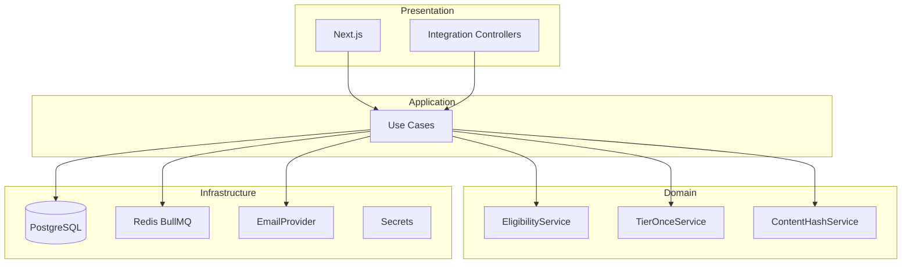

# Engineering Standards

## Payment Reminder Platform

| Field | Value |
|-------|-------|
| **Version** | 1.1 |
| **Last updated** | 2026-06-04 |
| **Related docs** | [PRD](../product/PRD.md) · [Agent Skills](../agents/skills.md) · [Reminder Agent](../agents/agent.md) |

---

## 1. Principles

1. **Single vendor per deployment** — Subscription vendors each get an isolated instance; no multi-tenant row isolation in one database.
2. **Audit all material actions** — Import, sync, mapping change, schedule run, send, digest, opt-out.
3. **Idempotent background jobs** — Safe retries; no duplicate tier sends for same `(invoice_id, tier)` across runs.
4. **Domain logic in domain layer** — Eligibility, next-tier rules, `content_hash`, opt-out, and consent checks are not duplicated in UI or workers.
5. **Least privilege** — DB connectors read-only where possible; API keys limited to integration routes.

---

## 2. Repository and branching

| Practice | Standard |
|----------|----------|
| Default branch | `main` (protected) |
| Branch naming | `feature/<ticket>-desc`, `fix/<ticket>-desc`, `chore/desc` |
| Commits | [Conventional Commits](https://www.conventionalcommits.org/): `feat:`, `fix:`, `docs:`, `chore:` |
| Pull requests | One concern; 1+ review; CI green; link to PRD section or ticket |
| Force push | Disallowed on `main` |

---

## 3. Technology stack

Aligned with [PRD §17](../product/PRD.md#17-technical-approach-recommended):

| Layer | Technology |
|-------|------------|
| Frontend | Next.js 14+, TypeScript, React |
| API | NestJS, TypeScript |
| Database | PostgreSQL 15+ |
| Migrations | **Prisma** (`prisma migrate`) |
| Queue | Redis 7+ with BullMQ |
| Email | AWS SES or SendGrid (adapter interface) |
| Object storage | S3-compatible for uploads |
| Auth | Session cookie + SSO (SAML/OIDC); API keys for integration |

---

## 4. Project structure (recommended)

```
/
├── apps/
│   ├── web/                 # Next.js UI
│   ├── api/                 # NestJS HTTP API
│   └── worker/              # BullMQ consumers (reminder-root pipeline)
├── packages/
│   ├── domain/              # Entities, eligibility, tier rules, hash
│   └── email-templates/     # Tier templates
├── docs/
│   ├── product/PRD.md
│   ├── engineering/standards.md
│   └── agents/
├── prisma/
└── openapi.yaml
```

---

## 5. Architecture and layering



### 5.1 Rules

- **Controllers:** HTTP validation, auth, DTO mapping only.
- **Use cases:** Orchestrate transactions; call domain services.
- **Domain:** Pure functions/classes; no framework imports.
- **Infrastructure:** Implements repositories and provider adapters.

### 5.2 Domain modules (required)

| Module | Responsibility |
|--------|----------------|
| `EligibilityService` | ELIG-01 through ELIG-07 ([PRD §8.3](../product/PRD.md#83-eligibility-rules-all-must-pass)) |
| `TierOnceService` | Next tier = min eligible `t` where `days_behind >= t` and `t > last_tier_sent` ([PRD §8.1](../product/PRD.md#81-tier-once-with-sequential-escalation-default)) |
| `ContentHashService` | Normalization + SHA-256 ([PRD §9.4](../product/PRD.md#94-content-hash-algorithm)) |
| `OptOutService` | Block send if `email_opt_out`; honor `consent_email` |

---

## 6. Code style

| Area | Standard |
|------|----------|
| Language | TypeScript strict mode (`strict: true`) |
| Formatting | Prettier; ESLint with `@typescript-eslint` |
| Naming | `camelCase` variables/functions; `PascalCase` types; `snake_case` DB columns |
| Files | `kebab-case` filenames for modules |
| API errors | RFC 7807 Problem Details (`application/problem+json`) |
| Dates | Store UTC in DB; convert with vendor `timezone` in domain |

---

## 7. Database standards

### 7.1 General

- Primary keys: UUID v4 (or ULID for sortable IDs).
- Timestamps: `created_at`, `updated_at` on all business tables.
- Money: `NUMERIC(12,2)`; never `float`.
- Migrations: forward-only in production; review destructive changes.

### 7.2 Core tables (illustrative)

- `invoices`, `schedules`, `schedule_runs`, `reminder_batches`, `send_log`, `notification_documents`, `audit_events`, `opt_out_events`, `mapping_profiles`, `api_keys`, `users`, `vendor_settings`.

### 7.3 Indexes (minimum)

```sql
CREATE UNIQUE INDEX idx_invoices_invoice_number ON invoices(invoice_number);
CREATE INDEX idx_invoices_due_date ON invoices(due_date);
CREATE INDEX idx_invoices_send_reminder ON invoices(send_reminder) WHERE send_reminder = true;
CREATE INDEX idx_invoices_status ON invoices(status);
CREATE INDEX idx_invoices_content_hash ON invoices(content_hash);
CREATE INDEX idx_audit_events_created_at ON audit_events(created_at);
```

### 7.4 Invoice uniqueness

- One vendor per deployment; **many clients** (customers) per deployment.
- **Unique constraint on `invoice_number`** per deployment (global within instance, not per client).
- Optional composite unique on `(external_client_id, invoice_number)` when vendor supplies client IDs.
- Do not use “tenant” for vendor’s clients in code or UI (avoid confusion with multi-vendor tenancy).

---

## 8. API standards

### 8.1 Routing

| Surface | Prefix | Auth |
|---------|--------|------|
| Vendor UI API | `/api/v1/` | Session or SSO JWT |
| Integration | `/api/v1/integration/` | API key header `X-API-Key` |

### 8.2 Conventions

- Version in path: `/api/v1/...`
- Pagination: cursor-based (`?cursor=&limit=50`)
- Bulk writes: `Idempotency-Key` header required
- OpenAPI 3.1 maintained at `/docs/openapi.yaml`; CI diff check on PR

### 8.3 Response codes

| Code | Use |
|------|-----|
| 200 | Success with body |
| 201 | Created |
| 204 | Success no body |
| 400 | Validation error (Problem Details) |
| 401 | Unauthenticated |
| 403 | Forbidden (wrong auth type for route) |
| 404 | Not found |
| 409 | Conflict (duplicate invoice) |
| 422 | Business rule violation (e.g. invalid tier) |

---

## 9. Security standards

| Requirement | Implementation |
|-------------|----------------|
| Transport | TLS 1.2+ everywhere |
| Secrets | Environment + vault; never in git |
| API keys | Hashed at rest (bcrypt/argon2); show once on create |
| Passwords | Argon2id; min 12 chars |
| PII in logs | Redact email/phone; use `invoice_id` in traces |
| OWASP | ASVS Level 2 for PII and financial data |
| Dependencies | `npm audit` / Snyk in CI; block critical |
| CSRF | Same-site cookies for session routes |
| Rate limit | Login 5/min/IP; integration 1000/min/key |

Connector credentials: encrypted at rest (AES-256 or KMS); decrypted only in worker memory for sync duration.

---

## 10. Background jobs and scheduling

### 10.1 Queue naming

- `schedule-run` — Main pipeline per [agent.md](../agents/agent.md)
- `email-send` — Outbound messages with retry
- `sync-connector` — Recurring data pull

### 10.2 Idempotency keys

```
schedule_run:{schedule_id}:{run_id}
send:{invoice_id}:{tier}:{run_id}
doc:{invoice_id}:{tier}:{run_id}
sync:{connector_id}:{run_id}
```

Workers must check idempotency store (Redis or DB) before side effects.

### 10.3 Retries

- Transient email/provider errors: exponential backoff, max 5 attempts.
- Permanent errors (invalid email): no retry; log and surface in dashboard.

---

## 11. Delta sync implementation

Follow [PRD §9.3–9.4](../product/PRD.md#93-recurring-db--api-sync):

1. Fetch rows from connector.
2. Normalize and compute `content_hash` (including sorted `services`, opt-out, consent).
3. Compare to stored hash; skip update if equal.
4. Upsert on difference; update `last_seen_at`.
5. Track `missed_sync_count` for absent rows.
6. Emit audit: `sync.completed` with `{ inserted, updated, skipped_unchanged, deactivated }`.

**Tests required:** unchanged row skipped; changed `balance_due` updates; missing row deactivates after N syncs.

---

## 12. Email and compliance implementation

### 12.1 Checklist (v1)

- [ ] List-Unsubscribe header on all reminder emails
- [ ] One-click unsubscribe → `email_opt_out` on all matching invoices in deployment
- [ ] Physical address from `vendor_physical_address` in footer
- [ ] Template version stored in `send_log.template_version`
- [ ] Counters updated on provider send/accept (email) or PDF generation success (document)
- [ ] `notification_documents` stored in S3-compatible bucket; HTML preview in app
- [ ] Optional webhook for bounce → update `send_log` only (does not drive counters)
- [ ] `email_opt_out` and `consent_email` checked before enqueue

### 12.2 SMS — not in v1

- [ ] No SMS UI, provider calls, or `client_phone` requirement

---

## 13. Testing standards

| Layer | Scope | Minimum |
|-------|-------|---------|
| Unit | `TierOnceService`, `EligibilityService`, `ContentHashService`, `OptOutService` | 80% branch coverage in domain package |
| Integration | Import mapping, sync delta, digest when enabled | Critical paths |
| E2E | Upload → schedule (test hook) → email mock → counter | One happy path per tier |

### 13.1 Required test cases

1. Tier-15 sends once; second run at 20 days does not send.
2. First evaluation at 31 days sends tier-15 only (not tier-30).
3. Tier-30 sends when `days_behind >= 30` and `last_tier_sent = 15`.
4. Paid or closed invoice excluded.
5. `send_reminder=false` excluded.
6. `email_opt_out=true` excluded.
7. `consent_email=false` excluded.
8. `content_hash` equal → no DB update.
9. Two schedules same day → no duplicate send for same invoice and tier.
10. `document_only` at tier-15 → PDF + HTML available; no email.
11. `email` mode unchanged; `reminder_delivery_mode` respected on mixed batch.

Use fixed clock and timezone `America/New_York` in tests.

---

## 14. Observability

### 14.1 Structured logging (JSON)

Fields: `timestamp`, `level`, `message`, `correlation_id`, `run_id`, `schedule_id`, `invoice_id` (not email).

### 14.2 Metrics

| Metric | Labels | PRD §2.2 |
|--------|--------|----------|
| `reminders_sent_total` | `tier` | — |
| `reminders_failed_total` | `tier`, `reason` | Delivery rate |
| `import_rows_valid_ratio` | — | Mapping success |
| `reminders_false_positive_total` | — | False-positive reminders |
| `sync_rows_unchanged_total` | — | Sync delta efficiency |
| `sync_rows_updated_total` | — | — |
| `opt_out_total` | `channel=email` | Opt-out latency (alert if > 5m) |
| `schedule_run_duration_seconds` | `schedule_id` | — |

### 14.3 Alerts

- Schedule job failure 2 consecutive times
- Email failure rate > 5% in 1 hour
- Sync connector auth failure
- Opt-out enforcement latency > 5 minutes

---

## 15. Documentation standards

| Artifact | Location | When to update |
|----------|----------|----------------|
| PRD | [docs/product/PRD.md](../product/PRD.md) | Behavior or scope change |
| Standards | This file | Stack or process change |
| Skills | [docs/agents/skills.md](../agents/skills.md) | New automation capability |
| Agent | [docs/agents/agent.md](../agents/agent.md) | Orchestration flow change |
| ADR | `docs/adr/NNNN-title.md` | Significant technical decision |
| OpenAPI | `openapi.yaml` | Any API change |

---

## 16. Definition of Done

- [ ] Acceptance criteria in [PRD §19](../product/PRD.md#19-acceptance-criteria-v1) satisfied for the feature
- [ ] Unit tests for domain rules; integration tests where applicable
- [ ] OpenAPI updated if API changed
- [ ] Audit events emitted for new user-visible actions
- [ ] No secrets or PII in diff
- [ ] [skills.md](../agents/skills.md) and [agent.md](../agents/agent.md) updated if automation behavior changed

---

## 17. Document history

| Version | Date | Changes |
|---------|------|---------|
| 1.0 | 2026-06-04 | Initial standards from approved plan |
| 1.1 | 2026-06-04 | Prisma; next-tier rules; remove approval; per-deployment opt-out; PRD metrics; subscription deployment |
| 1.2 | 2026-06-04 | reminder_delivery_mode; notification_documents; PDF+HTML; email-only |
