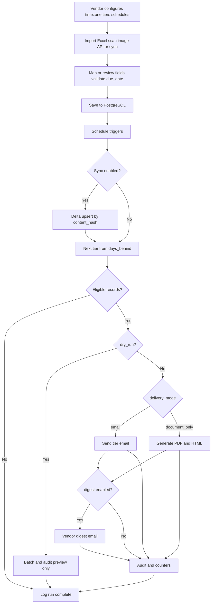

# Product Requirements Document (PRD)

## Payment Reminder Platform

| Field | Value |
|-------|-------|
| **Version** | 1.7 |
| **Status** | Approved for implementation |
| **Last updated** | 2026-06-12 |
| **Related docs** | [Engineering Standards](../engineering/standards.md) · [Agent Skills](../agents/skills.md) · [Reminder Agent](../agents/agent.md) |

---

## 1. Executive summary

The Payment Reminder Platform is a **subscription web service** for vendors and service providers. Each subscription provisions a **dedicated single-vendor deployment** (isolated app, database, and secrets) used to notify **clients** about unpaid balances via **email reminders** or **downloadable notification documents** (no SMS in v1).

Reminders escalate by days past the vendor-provided **`due_date`** at configurable milestones (default **15, 30, 45, and 60 days**). The **first reminder** is always the lowest overdue tier (default 15 days) once the client is at least that many days past due—even if they are already further overdue when first evaluated.

Vendors connect data through **Excel upload**, **invoice/receipt image scan**, **REST API**, or **recurring database/API sync**. The system maps source fields to a canonical invoice schema. For each client, vendors configure **how** overdue notices are delivered:

- **`email`** — automated tiered **email** reminders (CAN-SPAM compliant).
- **`document_only`** — no email; the system generates a **notification document** (PDF download + HTML preview) per eligible tier for the vendor to download and deliver offline (mail, in-person, etc.).

Vendors also set **`send_reminder`**, opt-out, and consent per client. Runs use **multiple schedules** (cron and RRULE) with vendor and schedule timezones. An optional **vendor digest** email summarizes each run (non-blocking).

**Primary users:** Vendor administrators and operations staff.  
**Secondary users:** End customers (email recipients when mode is `email`; no login in v1).

---

## 2. Goals and success metrics

### 2.1 Goals

- Reduce overdue receivables through consistent, tiered reminders starting at 15 days past due.
- Minimize vendor IT burden via flexible ingestion (Excel, invoice scan, API, DB) and reusable field mapping.
- Give vendors control: per-client delivery mode (email vs document), opt-in/opt-out, consent flags, multiple schedules, paid/closed handling.
- Meet **CAN-SPAM** and preparatory **TCPA** requirements with per-client opt-out and full audit trails.

### 2.2 Success metrics (implement in v1 observability)

| Metric | Target |
|--------|--------|
| Email delivery rate (valid addresses) | > 98% |
| Import mapping success (first upload) | > 95% rows valid |
| False-positive reminders (paid/zero balance) | < 1% |
| Sync delta efficiency | > 80% rows skipped unchanged on recurring sync |
| Opt-out processing latency | < 5 minutes from request to enforced |

---

## 3. Problem statement

Vendors and service providers track client balances in spreadsheets, databases, or industry tools. Following up on overdue amounts is manual and inconsistent. They need a subscription service that imports client records with **due dates**, sends the **first reminder 15 days after due date** (or immediately at first tier if already past that threshold), escalates through later tiers, runs on a reliable schedule, and complies with email regulations—without sharing a database with other vendors.

---

## 4. Deployment model

- **Subscription product:** Vendors subscribe to the platform; operations provision one **isolated deployment per vendor** (application + PostgreSQL + Redis + secrets).
- **Single vendor per deployment:** One **vendor organization** (the subscriber) per instance; no other vendors share that database.
- **Many clients per vendor:** A vendor may have **many clients** (their customers / accounts receivable parties). Each client can have one or more invoice records. Use **client** in docs and UI—not **tenant** (reserved to mean a subscribing vendor on a shared platform, which is out of scope in v1).
- **Invoice uniqueness:** `invoice_number` is **globally unique within the deployment**. Two different clients must not share the same `invoice_number`. Optional `external_client_id` groups multiple invoices under the same client for upsert and reporting.
- **Scaling:** Add vendor capacity by provisioning additional deployments (vertical scale per instance as needed).
- **Out of scope for v1:** Multi-tenant SaaS (many **vendors** in one shared application database).

---

## 5. Scope

### 5.1 In scope (v1)

| Area | Included |
|------|----------|
| Commercial model | Subscription onboarding/provisioning of per-vendor deployments (billing integration TBD) |
| Data ingestion | Excel/CSV upload with mapping UI + preview; invoice/receipt image scan (camera or upload) with AI field extraction and mandatory review before import; template download (xlsx/csv); multi-file import + upload history + selective upload deletion; REST bulk API; recurring DB/API connector |
| Delta sync | Content fingerprint (`content_hash`) to upsert only changed rows |
| Reminders | **Email only** (no SMS); configurable tiers (default 15 / 30 / 45 / 60 days); sequential tier-once |
| Notification documents | PDF download + HTML preview per tier when `reminder_delivery_mode = document_only` |
| Scheduling | Multiple named schedules; cron and RRULE; vendor + schedule timezones |
| Controls | Per-client `reminder_delivery_mode`, `send_reminder`, `email_opt_out`, `consent_email`; vendor digest (optional) |
| Paid/closed | Auto-exclude when `balance_due = 0` or `status = paid \| closed` |
| Counter | `notification_number` increments on successful email send or document generation |
| Compliance | Per-client opt-out, audit log, CAN-SPAM footer for email mode |
| Metrics | Dashboards/alerts for §2.2 success metrics |
| Vendor UI | Next.js admin app (`apps/web`): login, metrics dashboard, invoices, schedules, import (spreadsheet mapping + invoice scan + upload history), connectors, settings, audit — **Tailwind CSS v4** + **shadcn/ui** (Radix primitives) |
| Auth | Email/password + SSO for UI; API keys for integration endpoints only |

### 5.2 Out of scope (v1)

- SMS/push delivery and SMS preference UI.
- Multi-tenant SaaS on one shared deployment.
- Customer self-service portal or online payment.
- AI-generated **reminder message copy** (invoice field extraction via vision API is in scope — see §9.1.3).
- Vendor pre-approval gate before customer send.

### 5.3 Future considerations

- SMS via Twilio with TCPA consent enforcement.
- Additional connectors (QuickBooks, Google Sheets).
- Webhooks for ERP systems.
- White-label email branding per vendor.
- Shared multi-tenant platform (if product direction changes).
- Dark mode toggle (`next-themes`).
- Sidebar admin layout (replace top nav).
- Shared form validation via `react-hook-form` + shadcn `Form`.
- Invoice scan upload delete (`file_and_data` / `file_only`) parity with spreadsheet uploads.
- Vendor settings UI for `default_payment_terms_days`.
- PDF page support for invoice scans.
- Alternative extraction providers (e.g. Google Document AI) behind a provider interface.

---

## 6. User personas

### 6.1 Vendor administrator

Configures schedules, timezone, overdue tiers, email templates, digest setting, data sources, and compliance footer (physical address).

### 6.2 Vendor operator

Uploads Excel or scans invoice images, reviews mapping/extraction errors, sets per-client **delivery mode** (email vs document), opt-out and consent, toggles reminders, marks invoices paid, downloads notification documents, reviews send history and audit log.

### 6.3 End customer

Receives tiered reminder emails with invoice details and unsubscribe link. No application login.

---

## 7. Canonical data model

### 7.1 Invoice / client record (deployment-scoped)

| Field | Type | Required | Notes |
|-------|------|----------|-------|
| `client_name` | string | Yes | Display name |
| `invoice_number` | string | Yes | **Unique per deployment** (across all clients); primary business key |
| `external_client_id` | string | No | Vendor’s client identifier; use with `invoice_number` for upsert when one client has many invoices |
| `total_amount` | decimal(12,2) | Yes | Original invoice total |
| `balance_due` | decimal(12,2) | Yes | Must be > 0 for eligibility |
| `due_date` | date | Yes | **Required from vendor;** basis for overdue and first reminder at 15+ days |
| `date_of_service` | date | No | Shown in template |
| `services` | array | No | Strings or `{ name, amount? }`; normalized for `content_hash` |
| `reminder_delivery_mode` | enum | Yes | `email` (default) or `document_only` |
| `notification_number` | integer | System | Default 0; +1 per successful email or document |
| `client_email` | string | Conditional* | Required when `reminder_delivery_mode = email` |
| `comments` | text | No | Optional in template (vendor setting) |
| `send_reminder` | boolean | Yes | Default `true`; when false, no email and no documents |
| `status` | enum | Yes | `open`, `paid`, `closed` (default `open`); `paid` and `closed` treated alike for eligibility |
| `paid_at` | timestamp | No | Set when marked paid or `balance_due → 0` |
| `days_behind` | integer | Derived | `max(0, today - due_date)` in vendor timezone; not supplied on ingest |
| `last_tier_sent` | integer | System | One of `null`, or a value from `overdue_tiers` |
| `last_reminder_sent_at` | timestamp | No | Last successful email or document generation |
| `missed_sync_count` | integer | System | Consecutive syncs row absent from source |
| `content_hash` | string(64) | System | SHA-256 of normalized canonical fields |
| `last_seen_at` | timestamp | System | Last sync/import saw this row |
| `is_active` | boolean | System | `false` if missing from source N syncs |
| `email_opt_out` | boolean | Yes | Default `false`; set at import or by vendor per client; honored before send |
| `consent_email` | boolean | Yes | Default `true`; if `false`, block **email** send (ELIG-07); N/A for `document_only` |

\* Required when `reminder_delivery_mode = email`.

### 7.1.1 Notification document artifact (when `document_only`)

| Field | Type | Notes |
|-------|------|-------|
| `id` | uuid | Primary key |
| `invoice_id` | uuid | FK |
| `tier` | integer | Tier that triggered generation |
| `template_version` | string | Template used |
| `pdf_storage_key` | string | S3-compatible object key |
| `html_snapshot` | text or URL | Preview content |
| `generated_at` | timestamp | Creation time |
| `run_id` | uuid | Schedule run that produced it |

### 7.1.2 Spreadsheet upload persistence (M1)

Vendors can persist uploaded spreadsheets for history, re-upload conflict handling, and selective deletion of source-linked invoice rows.

| Table | Purpose |
|-------|---------|
| `spreadsheet_uploads` | One row per uploaded file (includes `original_filename`, stored file key/path, mapping profile id, column map snapshot, stats, uploader). |
| `spreadsheet_upload_invoices` | Junction table linking each uploaded spreadsheet to the imported invoice rows it created/updated. |

Storage (local disk in v1): `{STORAGE_ROOT}/uploads/{upload_id}/{original_filename}`.

### 7.1.3 Invoice scan upload persistence (M1)

Vendors can capture or upload invoice/receipt images; extracted fields are reviewed before upsert. Source images are stored for audit and review UI.

| Table | Purpose |
|-------|---------|
| `invoice_scan_uploads` | One row per scanned/uploaded image (`original_filename`, stored path, `mime_type`, `extraction_json`, `confirmed_fields`, stats, uploader). |
| `invoice_scan_upload_invoices` | Junction linking each scan upload to the invoice row created/updated on confirm. |

Storage (local disk in v1): `{STORAGE_ROOT}/scans/{upload_id}/{original_filename}`.

Extraction uses an external vision API (OpenAI, configurable via `OPENAI_API_KEY`). Images are sent to the provider for structured field extraction; results are not auto-imported without vendor confirmation.

### 7.2 Vendor settings

| Setting | Default | Description |
|---------|---------|-------------|
| `timezone` | `America/New_York` | IANA timezone for `days_behind` |
| `overdue_tiers` | `[15, 30, 45, 60]` | Sorted milestone days past due; templates map to `reminder_tier_{n}` |
| `missed_syncs_before_inactive` | `2` | Consecutive syncs absent → `is_active = false` |
| `include_comments_in_email` | `false` | Whether `comments` appear in customer template |
| `vendor_physical_address` | — | CAN-SPAM footer (required for production) |
| `digest_email_enabled` | `false` | Send non-blocking run summary to vendor users |
| `default_payment_terms_days` | `30` | When a scanned invoice has no explicit `due_date`, compute `due_date = invoice_date + N days`. Vendor may override on the review screen. |
| `reminders_enabled` | `true` | Master toggle for automatic reminder processing |
| `processing_preset` | `daily` | Vendor-facing cadence: `daily`, `weekly`, or `manual` |
| `processing_run_hour` | `8` | Hour (0–23) when daily/weekly check runs |
| `processing_weekly_day` | `1` | Day of week (0=Sun … 6=Sat) for weekly preset |

### 7.3 Schedule entity

| Field | Type | Description |
|-------|------|-------------|
| `id` | uuid | Primary key |
| `name` | string | e.g. "Weekly overdue check" |
| `cron_expression` or `rrule` | string | **Both formats supported in v1** |
| `timezone` | string | When the job fires; defaults to vendor timezone |
| `enabled` | boolean | Active flag |
| `run_sync_before_evaluate` | boolean | Trigger connector sync first |
| `dry_run` | boolean | Build batch + audit preview; no customer email |

**Timezone rules:** `days_behind` always uses **vendor `timezone`**. Schedule `timezone` controls **when** the job runs.

---

## 8. Overdue tiers and templates

### 8.1 Tier-once with sequential escalation (default)

1. Compute `days_behind` in vendor timezone: `max(0, today - due_date)`.
2. **No reminder** until `days_behind >=` minimum tier (default **15**).
3. **Next tier to send** = **smallest** `t` in `overdue_tiers` where `days_behind >= t` and (`last_tier_sent` is `null` or `t > last_tier_sent`).
4. **One tier per invoice per schedule run** (never send 15+30+45 in the same run).
5. On successful **email** (provider accept) or **document generation** (PDF + HTML stored): `last_tier_sent = t`, increment `notification_number`.
6. **Cross-schedule dedupe:** At most one notification (email or document) per `(invoice_number, tier)` per deployment lifetime.
7. Route by `reminder_delivery_mode`: `email` → [§14](#14-customer-email-delivery); `document_only` → [§14.1](#141-notification-documents-document_only).

| Scenario | Behavior |
|----------|----------|
| `days_behind = 10` | No send |
| First evaluation, `days_behind = 16` | Send **tier-15** (first reminder) |
| First evaluation, `days_behind = 31`, `last_tier_sent = null` | Send **tier-15** (not tier-30) |
| `days_behind = 31`, `last_tier_sent = 15` | Send **tier-30** |
| Weekly run, `days_behind = 20`, `last_tier_sent = 15` | No send until `days_behind >= 30` |

**Example:** Client first appears at 31 days overdue → tier-15 email once. On a later run at 35+ days with `last_tier_sent = 15`, no send until `days_behind >= 30`, then tier-30 once.

### 8.2 Template matrix

Vendors customize **subject** and **message body** per overdue milestone in Settings. The same copy applies to **email** and **document_only** delivery. System wraps vendor text with greeting (`Dear {{client_name}}`), invoice detail list, optional comments block, and CAN-SPAM footer (not editable in v1).

| Tier (days) | Template ID | Default tone |
|-------------|-------------|--------------|
| 15 | `reminder_tier_15` | Friendly first notice |
| 30 | `reminder_tier_30` | Firm follow-up |
| 45 | `reminder_tier_45` | Urgent |
| 60 | `reminder_tier_60` | Final notice |

Additional tiers use `reminder_tier_{n}` when `overdue_tiers` is customized. Missing custom row → system default from `@payment-reminder/email-templates`.

**Default subject:** `Payment reminder — invoice {{invoice_number}} ({{days_behind}} days past due)`

**Default body (vendor-editable portion):** headline `{{days_behind}} days past due` plus overdue/payment message using `{{tier}}`, `{{invoice_number}}`, `{{due_date}}`, `{{balance_due}}`.

Merge fields: `client_name`, `invoice_number`, `balance_due`, `total_amount`, `due_date`, `days_behind`, `tier`, `vendor_name`, `date_of_service`, `services`, `notification_number`, `comments` (optional).

| ID | Requirement |
|----|-------------|
| TMP-01 | Per-milestone subject + body stored in `reminder_milestone_templates`; one row per tier |
| TMP-02 | GET `/reminder-templates` merges configured tiers with stored rows and code defaults |
| TMP-03 | PATCH saves custom template (`isCustom: true`); POST reset deletes row and restores defaults |
| TMP-04 | POST `/reminder-templates/preview` renders HTML with sample or live invoice data |
| TMP-05 | `ReminderRunExecutor` loads custom templates at run start and passes override to email/document render |
| TMP-06 | Unknown `{{...}}` tokens in vendor text are left unchanged; only documented fields are replaced |

### 8.3 Eligibility rules (all must pass)

| ID | Rule |
|----|------|
| ELIG-01 | `send_reminder = true` |
| ELIG-02 | `is_active = true` |
| ELIG-03 | `status = open` and `balance_due > 0` |
| ELIG-04 | If `reminder_delivery_mode = email`: `client_email` present and valid. If `document_only`: email not required |
| ELIG-05 | If `email` mode: `email_opt_out = false`. If `document_only`: N/A |
| ELIG-06 | Next-tier rule in §8.1 satisfied (tier-once) |
| ELIG-07 | If `email` mode: `consent_email = true`. If `document_only`: N/A |

---

## 9. Data ingestion and sync

### 9.1 Excel / CSV upload (one-time or repeat)

- **ING-01:** Accept `.xlsx`, `.xls`, `.csv`; max file size configurable (default 25 MB).
- **ING-02:** Mapping UI: source column → canonical field with live preview (first 5 rows).
- **ING-03:** Required mappings (row-level):
  - Always: `client_name`, `invoice_number`, `total_amount`, `balance_due`, `due_date`
  - Conditional: `client_email` is required only when `reminder_delivery_mode = email`; if missing, the row imports as `document_only`.
- **ING-04:** Save **mapping profile** for repeat uploads.
- **ING-05:** Row-level validation errors returned by `POST /import/spreadsheet` and shown in the UI (CSV download of row errors is future enhancement).
- **ING-06:** Upsert key: `(invoice_number)` when unique per deployment, or `(external_client_id, invoice_number)` when the vendor supplies a client ID and multiple invoices per client.
- **ING-07:** Compute `content_hash` on ingest; update row only if hash changed or new.
- **ING-08:** Import may set `email_opt_out` and `consent_email` per row; vendor may adjust later in UI.
- **ING-09:** Upload history lists stored spreadsheets (`GET /import/uploads`); delete via `DELETE /import/uploads/:id?mode=`:
  - `file_and_data` (default): deletes stored file + removes invoice rows only linked exclusively to this upload (keeps shared invoices).
  - `file_only`: deletes stored file + upload record and removes upload→invoice junctions; keeps imported invoices.
  - UI uses a three-button confirmation: file+data / file-only / cancel.
- **ING-10:** Re-uploading the same filename prompts for override (`409` unless `override=true`); confirming replaces the stored file and reconciles invoices (removes rows only in the prior file when safe). Different filenames create new upload records and upsert invoices by `invoice_number`.
- **ING-11:** When the **Default spreadsheet** mapping profile is selected, vendor can download an Excel or CSV template generated from that profile’s column map via `GET /import/template` (optional `format=csv`). Response is a binary download.
- **ING-12:** Unknown spreadsheet headers can be mapped to canonical fields in the UI; mapping may be saved back to the profile or applied as a one-off `columnMap` on import.
- **ING-13:** Multi-file drag-and-drop import on the Import page with per-file queue status.
- **ING-14:** Batch import: `POST /import/spreadsheet/batch` processes multiple files; filename conflicts are returned per file (`409`) without failing the whole batch.
- **ING-15:** Spreadsheet currency formatting is normalized during import before upsert (supports `$`, commas, and accounting parentheses like `($1,234.00)`).
- **ING-16:** Header matching normalizes incoming headers (trim + strip UTF-8 BOM) before diffing vs the selected mapping profile.

#### 9.1.1 Import API (v1)

| Method | Path | Purpose |
|--------|-------|---------|
| GET | `/import/template` | Download `.xlsx` (default) or CSV template (`format=csv`) |
| GET | `/import/uploads` | List stored uploads |
| DELETE | `/import/uploads/:id?mode=file_and_data|file_only` | Delete upload; optionally reconcile linked invoices |
| POST | `/import/preview` | Return headers + sample rows + unknown headers for mapping UI |
| POST | `/import/spreadsheet` | Upload file; `override=true` replaces same filename |
| POST | `/import/spreadsheet/batch` | Upload multiple files (per-file conflict handling) |

#### 9.1.2 Replace & delete rules

**Same filename + override (`override=true`)**
1. Parse the new file and upsert invoices.
2. Remove invoice rows only if they were linked to the old upload but are not present in the new file and are not shared by other uploads.

**Delete upload**
1. `file_and_data` deletes the stored file and removes exclusive invoice links (and invoice rows when this upload is the last link).
2. `file_only` deletes the stored file and upload record while keeping invoice rows (junction rows are removed).

`days_behind` is **always computed** by the system from `due_date`; imported values are ignored.

### 9.1.3 Invoice / receipt scan (camera or image upload)

Vendors import a single invoice per image by scanning with a device camera or uploading one or more image files. The system extracts structured fields, presents a **mandatory review screen**, and upserts on confirm via the same upsert path as spreadsheet import.

- **SCAN-01:** Accept one invoice per image: JPEG, PNG, WebP, GIF; max file size 10 MB per image.
- **SCAN-02:** UI supports device camera capture (`capture="environment"`) and multi-image file picker; each image produces one review record.
- **SCAN-03:** Extraction fields (target): `invoice_number`, `client_name`, `total_amount`, `balance_due`, `services` (line items / service descriptions), `invoice_date`, `due_date`, `client_email` (optional).
- **SCAN-04:** Extraction provider: OpenAI vision API (`OPENAI_API_KEY`; model configurable via `OPENAI_VISION_MODEL`, default `gpt-4o-mini`). Structured JSON schema response with per-field confidence scores.
- **SCAN-05:** **Review required:** vendor must confirm or edit all required fields before import; no silent auto-import.
- **SCAN-06:** Required on confirm: `invoice_number`, `client_name`, `total_amount`, `balance_due`, `due_date`.
- **SCAN-07:** `due_date` resolution:
  1. Use extracted `due_date` when present and valid.
  2. Else if `invoice_date` extracted → `due_date = invoice_date + default_payment_terms_days` (vendor setting, default 30).
  3. Else vendor must enter `due_date` on review screen (confirm blocked until valid).
- **SCAN-08:** `client_email` optional; if absent → `reminder_delivery_mode = document_only` (same rule as spreadsheet import).
- **SCAN-09:** `services` stored on invoice as JSON array (`[{ name, amount? }]`) and included in `content_hash`.
- **SCAN-10:** Upsert key and `content_hash` behavior identical to §9.1 (`ING-06`, `ING-07`).
- **SCAN-11:** Each extract stores the image and raw extraction JSON; confirm persists `confirmed_fields` and links upload → invoice via junction table.
- **SCAN-12:** Scan history list (`GET /import/scan/history`). Delete upload parity with spreadsheet uploads is **future** (not in initial M1).
- **SCAN-13:** Batch extract and batch confirm supported; per-image errors do not fail the whole batch.
- **SCAN-14:** Audit events: `import.scan.extract`, `import.scan.confirm`.

#### 9.1.3.1 Invoice scan API (v1)

| Method | Path | Purpose |
|--------|-------|---------|
| POST | `/import/scan/extract` | Multipart `file` → extraction preview + `scanId` (image stored) |
| POST | `/import/scan/extract/batch` | Multipart `files` → per-file preview or error |
| POST | `/import/scan/confirm` | JSON confirmed fields → upsert one invoice |
| POST | `/import/scan/confirm/batch` | JSON `{ items: [...] }` → upsert many |
| GET | `/import/scan/history` | List scan uploads |
| GET | `/import/scan/:id/image` | Inline image for review UI (session auth) |

#### 9.1.3.2 Extract → confirm flow

1. Vendor uploads/captures image → `POST /import/scan/extract`.
2. API stores image, calls vision provider, returns `extracted`, `suggestedDueDate`, `paymentTermsDays`, `scanId`.
3. Vendor reviews/edits fields in UI (image shown alongside form; confidence badges on fields).
4. Vendor confirms → `POST /import/scan/confirm` → validate → upsert → link scan upload to invoice.
5. Duplicate `invoice_number` updates existing row per standard upsert rules.

### 9.2 Vendor REST API (integration)

- **API-01:** Routes under `/api/v1/integration/*`; authenticate with **API key** only (no session cookie).
- **API-02:** `POST /invoices/bulk` — upsert with `Idempotency-Key` header.
- **API-03:** `PATCH /invoices/{invoice_number}` — partial update.
- **API-04:** `GET /health` — connector health.
- **API-05:** OpenAPI 3.1 spec published at `/docs/openapi.yaml`.

### 9.3 Recurring DB / API sync

- **SYNC-01:** Vendor configures connector (credentials in vault, query or endpoint).
- **SYNC-02:** Runs on schedule (`run_sync_before_evaluate`) or manual trigger.
- **SYNC-03:** **Delta sync:** compute `content_hash` per incoming row; skip DB write if hash matches stored hash (log `skipped_unchanged`).
- **SYNC-04:** If source provides `updated_at`, use as pre-filter to reduce rows fetched.
- **SYNC-05:** New rows: insert with `last_seen_at = now`.
- **SYNC-06:** Missing rows: increment `missed_sync_count`; when `>= missed_syncs_before_inactive`, set `is_active = false` (do not delete history).
- **SYNC-07:** When `balance_due = 0` or status paid/closed from source → set `status = paid`, `paid_at`, stop reminders.

### 9.4 Content hash algorithm

```
normalized = canonical_json({
  external_client_id, invoice_number, client_name,
  total_amount, balance_due, due_date, date_of_service,
  services (sorted by name; strings as {name}; amounts as 2-decimal strings),
  client_email, comments, status, email_opt_out, consent_email,
  reminder_delivery_mode
})
content_hash = SHA-256(normalized)
```

TLS in transit for all connectors; credentials encrypted at rest (KMS/vault). Hash is for **change detection**, not encryption of PII.

---

## 10. Per-client reminder toggle

- **TOG-01:** List and detail views show `send_reminder` switch; default **On** for new imports.
- **TOG-02:** When off, record remains stored but is excluded from eligibility (ELIG-01).

---

## 11. Scheduling

### 11.1 Two-layer vendor UX (Option C)

Vendors configure reminders in **Settings** using two layers:

**Layer 1 — Reminder rules** (what clients experience)
- Overdue milestone tiers (`overdue_tiers`), with presets Standard / Gentle / Custom.
- Delivery channel per invoice (`reminder_delivery_mode`); not configured in the schedule.

**Layer 2 — Processing schedule** (when the system runs)
- Presets: **Daily**, **Weekly** (pick day + hour), **Manual only**.
- Master toggle: reminders enabled/disabled.
- Optional: sync connectors before evaluate.
- Cron/RRULE hidden from default UI; one **canonical schedule** per deployment synced from Settings.

**Schedules page** (ops): run history, dry-run, manual “Run now”, read-only processing summary. Link back to Settings to edit.

#### 11.1.1 Reminder config API

| Method | Path | Purpose |
|--------|------|---------|
| GET | `/reminder-config` | Combined Layer 1 + Layer 2 view |
| PATCH | `/reminder-config` | Update tiers + processing; syncs canonical schedule (admin) |

### 11.2 Schedule engine requirements

- **SCH-01:** Vendor may create **multiple schedules** via API (advanced); default UI manages one canonical schedule only.
- **SCH-02:** Each schedule supports **cron and RRULE**, timezone, enabled flag.
- **SCH-03:** On trigger: optional sync → eligibility → email and/or document fulfillment → optional vendor digest.
- **SCH-04:** `dry_run` creates batch and audit preview; no customer email and no document files written.
- **SCH-05:** `days_behind` uses vendor `timezone`; job execution uses schedule `timezone` (or vendor default).
- **SCH-06:** Settings `PATCH /reminder-config` upserts canonical schedule (`00000000-0000-4000-8000-000000000001`).
- **SCH-07:** Processing presets map to cron: daily `0 H * * *`, weekly `0 H * * DOW`; manual sets `enabled = false`.

---

## 12. Vendor digest (optional)

- **DIG-01:** When `digest_email_enabled = true`, after a schedule run completes, email vendor users a **non-blocking** summary (counts by tier, failures, dry-run indicator).
- **DIG-02:** Digest does not delay or gate customer sends.
- **DIG-03:** Audit event `reminder.digest.sent` with `batch_id` and counts.

---

## 13. Paid and closed invoices

- **PAY-01:** Operator can mark invoice **paid** or **closed** in UI → `status` updated, `paid_at` set, `balance_due` may be zeroed.
- **PAY-02:** Sync/import may set `balance_due = 0` or `status = paid` → same exclusion.
- **PAY-03:** Paid/closed invoices never appear in eligibility; `last_tier_sent` retained for history.
- **PAY-04:** `notification_number` is historical; does not reset on paid (lifetime per invoice).

---

## 14. Customer email delivery (`reminder_delivery_mode = email`)

- **SND-01:** Provider: AWS SES or SendGrid (deployment choice).
- **SND-02:** Increment `notification_number` and set `last_tier_sent` when provider **accepts/sends** the message (HTTP/API success). Delivery webhooks may update `send_log` only; they do not gate counters in v1.
- **SND-03:** Include List-Unsubscribe header and one-click unsubscribe URL.
- **SND-04:** CAN-SPAM: physical address in footer, truthful subject, vendor identification.
- **SND-05:** Failed sends retried per provider policy; manual retry from dashboard (v1).

### 14.1 Notification documents (`document_only`)

- **DOC-01:** Use the same tier templates and merge fields as email ([§8.2](#82-template-matrix)).
- **DOC-02:** On eligibility, render **HTML preview** (in-app) and generate **PDF** (stored S3-compatible); persist `notification_documents` row ([§7.1.1](#711-notification-document-artifact-when-document_only)).
- **DOC-03:** Vendor downloads PDF per invoice/tier from dashboard; **batch ZIP** of all documents from a schedule run.
- **DOC-04:** Increment `notification_number` and `last_tier_sent` when PDF generation succeeds (same tier-once rules as email).
- **DOC-05:** No List-Unsubscribe or customer email for this mode; vendor is responsible for offline delivery.
- **DOC-06:** Audit: `document.generated`, `document.failed` with `invoice_id`, tier, template version.

---

## 15. Compliance and audit

### 15.1 Email (CAN-SPAM) — required v1

- Unsubscribe link in every reminder email.
- **Per-invoice `email_opt_out`** (primary): set at import or by vendor; unsubscribe link sets `email_opt_out = true` on all invoices in the deployment with that email.
- Optional `opt_out_events` table for audit of link clicks.
- Vendor physical address in footer.
- Audit: `email.sent`, `email.failed`, `email.opt_out`.

### 15.2 SMS — not in v1

- No SMS reminders or SMS configuration in v1 UI.

### 15.3 Audit log (required v1)

Immutable append-only events including:

- Data import/sync (counts, errors, skipped unchanged); invoice scan extract and confirm (`import.scan.extract`, `import.scan.confirm`).
- Mapping profile changes.
- Schedule run start/end.
- Per-message send result with `invoice_number`, tier, template version.
- Document generated (`document_only`) with storage key.
- Vendor digest sent.

Retention: minimum **2 years** (configurable).

---

## 16. Authentication and authorization

| Actor | Method | Access |
|-------|--------|--------|
| Vendor user (UI) | Email/password or SSO (SAML 2.0 / OIDC) | Full app for this deployment except integration key management |
| Integration | API key (scoped) | `/api/v1/integration/*` only |
| Session | HTTP-only secure cookie or JWT | Vendor UI routes |

- **AUTH-01:** Password policy: min length 12, breach check optional.
- **AUTH-02:** SSO configurable per deployment (IdP metadata env vars).
- **AUTH-03:** API keys rotatable; last-used timestamp; never logged in plain text.
- **AUTH-04:** Roles (v1): `admin`, `operator` (admin configures connectors and schedules).

---

## 17. Technical approach (recommended)

| Layer | Choice | Rationale |
|-------|--------|-----------|
| Frontend | Next.js 14 + TypeScript + Tailwind CSS v4 + shadcn/ui | Vendor admin UI; CSS-first theme in `globals.css`; shared components in `components/ui/` |
| API | NestJS + TypeScript | OpenAPI, modular domain |
| Database | PostgreSQL | Relational invoices, audit, schedules |
| Queue | Redis + BullMQ | Per-schedule workers, retries |
| Email | AWS SES or SendGrid | Templates, webhooks |
| Files | S3-compatible | Excel and scan image storage |
| Invoice extraction | OpenAI vision API | Structured field extraction from invoice/receipt images |
| Secrets | Vault / cloud KMS | DB credentials, `OPENAI_API_KEY` |

**Environment (invoice scan):**

| Variable | Required | Description |
|----------|----------|-------------|
| `OPENAI_API_KEY` | Yes (for scan) | Vision API key for invoice extraction |
| `OPENAI_VISION_MODEL` | No | Default `gpt-4o-mini` |

See [Engineering Standards](../engineering/standards.md) for implementation conventions.

### 17.1 Vendor UI (implemented)

**Stack:** Tailwind CSS v4 (`@import "tailwindcss"`), shadcn/ui (new-york style), Inter via `next/font`, Radix primitives for dialogs and selects.

**Shell:** top nav + `max-w-6xl` content area (`apps/web/components/nav.tsx`, `app-shell.tsx`).

**Routes (`apps/web`):** login, dashboard, invoices, schedules, import (spreadsheet + `/import/scan`), connectors, settings, audit.

**Patterns:** `Card` for sections, `Table` for list views, `Dialog` for confirmations (import delete/override), `Alert` for validation errors.

**Requirements:**

- **UI-01:** All authenticated routes share a consistent shell (nav, layout, typography).
- **UI-02:** Destructive or irreversible actions use an accessible confirmation dialog (import upload delete, file replace override).
- **UI-03:** Forms and tables use shared shadcn/ui components; no ad-hoc global CSS utility classes.
- **UI-04:** Import validation errors are visible inline (destructive alert) after upload.
- **UI-05:** Import page uses tabs for spreadsheet vs invoice scan.
- **UI-06:** Invoice scan shows image preview beside editable extracted fields; low-confidence fields are visually flagged.
- **UI-07:** Confirm import is explicit per scan record; imported scans show a completed state.
- **UI-08:** Settings exposes Reminder rules (tiers), Email templates (per-milestone subject/body + preview), and Processing schedule (cadence presets).
- **UI-09:** Schedules page shows human-readable processing summary and run history (not raw cron).
- **UI-10:** Manual dry-run and live runs available from Schedules page regardless of processing preset.
- **UI-11:** Settings email template editor: milestone select, subject/body with merge-field chips, preview panel, save and reset to system default.

---

## 18. User flows



---

## 19. Acceptance criteria (v1)

1. Vendor uploads Excel, maps required fields (including `due_date`), and persists valid invoices with `content_hash`.
2. Recurring sync skips unchanged rows (verified in logs: `skipped_unchanged > 0` on second run).
3. At 15 days overdue, tier-15 email sends once; second weekly run at 20 days does not resend; tier-30 sends when `days_behind >= 30` and tier-15 already sent.
4. First evaluation at 31 days overdue with no prior send delivers **tier-15 only** (not tier-30).
5. `send_reminder = false` excludes record from send.
6. Paid/`balance_due = 0` or `closed` excludes record from send.
7. `email_opt_out = true` or unsubscribe excludes record; event audited.
8. `consent_email = false` excludes **email** mode only.
9. Two schedules same day do not duplicate notification for same `(invoice_number, tier)`.
10. `notification_number` increments when provider accepts/sends email **or** document PDF is generated.
11. `reminder_delivery_mode = document_only`: tier-15 produces downloadable PDF + HTML preview; **no email** sent.
12. Vendor can download per-document PDF and batch ZIP for a run.
13. Optional vendor digest sent when `digest_email_enabled = true`.
14. API key cannot access vendor UI session routes.
15. §2.2 success metrics exposed in monitoring/dashboards.
16. Vendor can download a valid Excel/CSV template and import rows with currency-formatted amounts.
17. Re-uploading the same filename triggers override flow; unique `invoice_number` rows append across different files.
18. Upload deletion supports both `file_and_data` and `file_only` modes via the UI confirmation dialog.
19. Vendor UI renders all primary routes using the shared shadcn/ui component set; import delete dialog offers `file_and_data`, `file_only`, and cancel.
20. Vendor scans or uploads an invoice image; reviews extracted fields; confirms import; invoice appears in list with correct `due_date` (explicit or Net-30 default).
21. Multi-image scan batch returns one review record per image; per-image extraction errors do not block other images.

---

## 20. Milestones

| Phase | Deliverables |
|-------|----------------|
| **M0** | PRD, standards, agent docs (this package) |
| **M1** | Auth, schema, Excel/CSV import + mapping profiles, upload history + conflict override, template download, multi-file import, selective upload deletion, and invoice/receipt image scan with review-before-import |
| **M2** | Schedules, tier eligibility, email send + notification documents (PDF/HTML) |
| **M3** | API integration, delta sync, opt-out + audit + metrics |
| **M4** | Vendor digest, DB connector, dashboard (Next.js + Tailwind v4 + shadcn/ui) |
| **M5** | Hardening, per-vendor deployment runbooks |

---

## 21. Risks and mitigations

| Risk | Mitigation |
|------|------------|
| Duplicate tier emails | Tier-once + `last_tier_sent`; idempotency per invoice/tier/run |
| Stale balances | Recurring sync + `content_hash` |
| Regulatory violation | Opt-out, consent, footer, audit for email mode; vendor delivers documents offline |
| Wrong mapping | Preview UI + validation report; required `due_date` |
| OCR extraction errors | Mandatory review screen before import; confidence badges; vendor edits all required fields |
| Unexpected send volume | `dry_run` schedules + optional vendor digest |

---

## 22. Glossary

| Term | Definition |
|------|------------|
| `content_hash` | SHA-256 fingerprint for delta sync |
| `days_behind` | Calendar days past `due_date` in vendor timezone |
| `last_tier_sent` | Highest overdue tier email already sent for this invoice |
| `notification_number` | Count of successful reminder emails per invoice |
| Tier-once | At most one email per tier per `invoice_number`; escalate sequentially (15 → 30 → 45 → 60) |
| Next tier | Smallest overdue tier eligible to send, not the largest matched tier |
| Deployment | Isolated single-vendor instance (app + database + secrets) |
| Vendor | Subscribing organization; exactly one per deployment |
| Client | Vendor’s customer (debtor); many clients per deployment; not a platform tenant |
| `invoice_number` | Unique identifier for an invoice within a deployment (not reusable across clients) |

---

## 23. Document history

| Version | Date | Changes |
|---------|------|---------|
| 1.0 | 2026-06-04 | Initial PRD from approved plan |
| 1.1 | 2026-06-04 | Subscription + single-tenant deployment; remove approval; sequential tier-once; per-client opt-out/consent; digest; metrics; send-time counters |
| 1.2 | 2026-06-04 | Per-client `reminder_delivery_mode` (email \| document_only); PDF + HTML notification documents; email-only (no SMS) |
| 1.2.1 | 2026-06-04 | Clarify many clients per vendor; `invoice_number` unique per deployment; client vs tenant terminology |
| 1.3 | 2026-06-05 | M1 Excel/CSV import enhancements: templates (xlsx/csv), currency/header normalization, multi-file + batch import, and selective upload delete modes |
| 1.4 | 2026-06-05 | Vendor UI migrated to Tailwind CSS v4 + shadcn/ui; §17.1 UI requirements (UI-01–04); M4 dashboard stack clarified |
| 1.5 | 2026-06-12 | Invoice/receipt image scan (§9.1.3): OpenAI vision extraction, review-before-import, Net-30 due date fallback, scan upload persistence (§7.1.3), UI-05–07, `default_payment_terms_days` vendor setting |
| 1.6 | 2026-06-12 | Option C two-layer reminder scheduling: `/reminder-config` API, Settings reminder/processing cards, Schedules ops view, SCH-06–07, UI-08–10 |
| 1.7 | 2026-06-12 | Per-milestone email/document templates: `/reminder-templates` API, Settings template editor + preview, TMP-01–06, UI-11; customizable subject/body with merge fields |
