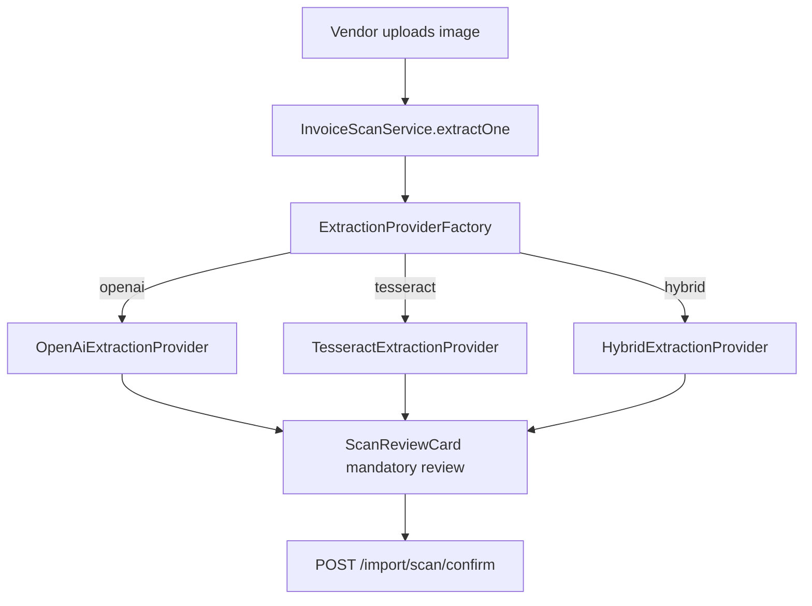

# Product Requirements Document (PRD)

## Tesseract OCR — Invoice Scan Extraction

| Field | Value |
|-------|-------|
| **Version** | 1.0 |
| **Status** | Draft |
| **Last updated** | 2026-06-24 |
| **Related docs** | [Main PRD §9.1.3](./PRD.md) · [Engineering Standards](../engineering/standards.md) · [Runbook](../operations/runbook.md) |

---

## 1. Executive summary

This document specifies **Tesseract OCR** as a free, on-premises extraction provider for the existing **invoice/receipt scan** import flow defined in [PRD §9.1.3](./PRD.md#913-invoice--receipt-scan-camera-or-image-upload).

Today, scan extraction depends on the **OpenAI Vision API** (`OPENAI_API_KEY`). Without it, `POST /import/scan/extract` fails. Tesseract adds a **local OCR path** that:

- Runs entirely on the vendor deployment (no outbound vision API for the `tesseract` mode).
- Prefills the same canonical fields used by the mandatory review screen.
- Complements OpenAI Vision — it does not replace human confirmation before import.

The extract → review → confirm pipeline, upsert rules, and audit events remain unchanged.

---

## 2. Goals

| Goal | Description |
|------|-------------|
| **Zero API cost** | Enable invoice scan in dev, CI, and cost-sensitive deployments without OpenAI billing. |
| **Data privacy** | Keep invoice images on the single-vendor deployment when using `tesseract` mode. |
| **Unblock local dev** | Scan import works when `OPENAI_API_KEY` is unset (default to Tesseract). |
| **Provider flexibility** | Pluggable extraction behind one interface; supports `openai`, `tesseract`, and `hybrid`. |
| **PDF foundation** | Phase 2 rasterizes PDF pages for OCR, addressing the main PRD future item for PDF invoice scans. |

---

## 3. Success metrics

| Metric | Target |
|--------|--------|
| Scan extract succeeds without `OPENAI_API_KEY` (tesseract mode) | 100% when Tesseract binary is installed |
| Field prefill on clean typed invoices (invoice #, amounts, dates) | > 70% fields correct before vendor edit |
| Silent auto-imports | 0 (review required per SCAN-05) |
| Review-to-confirm completion rate | No regression vs OpenAI-only baseline |
| Hybrid mode OpenAI calls avoided (clean scans) | > 50% of batch scans in pilot |
| OCR provider errors with actionable message | 100% (missing binary, unsupported mime) |

---

## 4. Problem statement

Vendors import overdue invoice data by photographing or uploading invoice images. The platform already stores images, calls a vision provider, and presents a **mandatory review screen** before upsert.

**Pain points today:**

1. **Blocked without OpenAI** — `InvoiceExtractionService` throws `503` when `OPENAI_API_KEY` is missing.
2. **Per-image API cost** — Simple, machine-printed invoices incur the same vision API cost as complex layouts.
3. **External data transfer** — Privacy-conscious vendors send invoice images to a third-party API.
4. **No PDF path** — Main PRD lists PDF page support as future work; Tesseract + rasterization is a natural fit.

Tesseract addresses cost, privacy, and local-dev gaps. OpenAI Vision remains the quality tier for messy photos, handwriting, and complex tables.

---

## 5. Scope

### 5.1 In scope

- `InvoiceExtractionProvider` interface and factory.
- `TesseractExtractionProvider` using system Tesseract binary.
- `ocr-field-parser.ts` — heuristic field extraction from OCR plain text.
- Environment configuration (`INVOICE_EXTRACTION_PROVIDER`, etc.).
- Unit tests with fixture images and parser tests (no OpenAI in CI for tesseract path).
- Runbook notes for installing `tesseract-ocr` on API hosts.
- Optional `ocrText` and `provider` metadata in stored `extractionJson`.
- Audit enrichment: `provider` on `import.scan.extract`.

### 5.2 Out of scope (v1 OCR)

- Handwritten invoice accuracy guarantees.
- Silent auto-import (violates SCAN-05).
- Replacing or redesigning the review UI.
- Full-text search UI over OCR text (future).
- Google Document AI or other paid providers (future interface only).

### 5.3 Phased delivery

| Phase | Deliverable |
|-------|-------------|
| **Phase 1** | Provider abstraction + Tesseract fallback (MVP) |
| **Phase 2** | PDF upload → rasterize → OCR |
| **Phase 3** | Hybrid mode (OCR first, OpenAI on low confidence) |

---

## 6. User personas

Reuse [Main PRD §6.2 — Vendor operator](./PRD.md#62-vendor-operator):

> Uploads Excel or scans invoice images, reviews mapping/extraction errors, sets per-client delivery mode, toggles reminders, marks invoices paid, downloads notification documents, reviews send history and audit log.

No new personas. OCR changes are invisible except for optional provider badge and confidence scores on the review form.

---

## 7. Provider architecture

### 7.1 Interface

All providers implement a single contract returning `ExtractedInvoiceFields` (see `apps/api/src/import/scan/invoice-scan.types.ts`):

```typescript
interface InvoiceExtractionProvider {
  readonly name: "openai" | "tesseract" | "hybrid";
  extractFromImage(buffer: Buffer, mimeType: string): Promise<ExtractedInvoiceFields>;
}
```

`InvoiceExtractionService` becomes a thin facade that delegates to `ExtractionProviderFactory`.

### 7.2 Flow



### 7.3 Provider selection

| Mode | Behavior |
|------|----------|
| `openai` | Current behavior — OpenAI Vision structured JSON extraction. Requires `OPENAI_API_KEY`. |
| `tesseract` | Local OCR → field parser. No outbound vision API. Requires system `tesseract` binary. |
| `hybrid` | Run Tesseract first; if aggregate field confidence below threshold, call OpenAI Vision. Requires both Tesseract and `OPENAI_API_KEY`. |

**Default resolution** (when `INVOICE_EXTRACTION_PROVIDER` unset):

1. If explicitly set env value → use it.
2. Else if `OPENAI_API_KEY` present → `openai`.
3. Else → `tesseract`.

---

## 8. Functional requirements

Requirements extend [SCAN-*](./PRD.md#913-invoice--receipt-scan-camera-or-image-upload) from the main PRD.

| ID | Requirement |
|----|-------------|
| **OCR-01** | `INVOICE_EXTRACTION_PROVIDER` selects the active provider without changing public API contracts. |
| **OCR-02** | `tesseract` mode performs extraction locally; no outbound vision API calls. |
| **OCR-03** | When `tesseract` is selected and the system binary is missing, return `503 Service Unavailable` with an actionable message (install `tesseract-ocr`). |
| **OCR-04** | All providers return `ExtractedInvoiceFields` including a `confidence` map keyed by snake_case field names. |
| **OCR-05** | Mandatory review unchanged (SCAN-05); no silent auto-import. |
| **OCR-06** | `hybrid` mode calls OpenAI only when aggregate OCR confidence is below `HYBRID_OCR_CONFIDENCE_THRESHOLD`. |
| **OCR-07** | Audit event `import.scan.extract` includes `provider` (`openai` \| `tesseract` \| `hybrid`). |
| **OCR-08** | Stored `extractionJson` may include `ocrText` (full OCR plain text) and `provider` for debugging and future search. |
| **OCR-09** | Tesseract language configurable via `TESSERACT_LANG` (default `eng`). |
| **OCR-10** | Optional `TESSERACT_CMD` overrides path to the Tesseract binary. |
| **OCR-11** | Field parser extracts: `invoice_number`, `client_name`, `total_amount`, `balance_due`, `invoice_date`, `due_date`, `client_email`. |
| **OCR-12** | `services` line items are best-effort from OCR text; vendor may edit on review. |
| **OCR-13** | Per-field confidence derived from Tesseract word confidence scores where matched; default `0.5` for heuristic-only matches. |
| **OCR-14** | Existing mime types unchanged in Phase 1: JPEG, PNG, WebP, GIF (SCAN-01). |
| **OCR-15** | Phase 2 adds `application/pdf` (first page rasterized at 300 DPI before OCR). |
| **OCR-16** | Batch extract (`POST /import/scan/extract/batch`) uses the same provider per deployment. |
| **OCR-17** | Provider errors on one image in a batch do not fail the whole batch (SCAN-13). |
| **OCR-18** | OpenAI provider behavior unchanged when `INVOICE_EXTRACTION_PROVIDER=openai`. |
| **OCR-19** | CI runs parser unit tests and optional Tesseract integration tests when binary is available. |
| **OCR-20** | Runbook documents Tesseract installation for Docker and bare-metal API deployments. |

---

## 9. Field extraction (Tesseract path)

### 9.1 Pipeline

1. **Preprocess** (optional Phase 1.1): grayscale, deskew if library available.
2. **OCR**: Tesseract → plain text + word-level confidence.
3. **Parse**: `ocr-field-parser.ts` applies label-aware regex and heuristics.

### 9.2 Parser rules (initial)

| Field | Heuristic |
|-------|-----------|
| `invoice_number` | Labels: `Invoice #`, `Invoice No`, `INV-`; or standalone alphanumeric token near top |
| `client_name` | Lines after `Bill To`, `Customer`, `Client` labels |
| `total_amount` | `Total`, `Amount Due`, `Grand Total` + currency pattern |
| `balance_due` | `Balance Due`, `Amount Outstanding`; fallback to `total_amount` if only one amount |
| `invoice_date` | `Invoice Date`, `Date` + date patterns (`MM/DD/YYYY`, `YYYY-MM-DD`) |
| `due_date` | `Due Date`, `Payment Due` + date patterns |
| `client_email` | Standard email regex |
| `services` | Lines between item header row and subtotal (best-effort) |

Amounts normalized to plain decimal strings (no `$`, commas) matching existing `normalizeExtraction` behavior.

### 9.3 Confidence

- Matched via Tesseract word boxes → average word confidence for that field (0–1).
- Heuristic-only match without word alignment → `0.5`.
- No match → field omitted; confidence omitted.

Review UI already renders badges from confidence in `scan-review-card.tsx` (High ≥ 0.85, Review ≥ 0.6, Low < 0.6).

---

## 10. API impact

No new public endpoints. Existing scan API unchanged:

| Method | Path | Change |
|--------|------|--------|
| POST | `/import/scan/extract` | Same request/response; extraction backend varies by provider |
| POST | `/import/scan/extract/batch` | Same |
| POST | `/import/scan/confirm` | Unchanged |
| POST | `/import/scan/confirm/batch` | Unchanged |
| GET | `/import/scan/history` | Unchanged |
| GET | `/import/scan/:id/image` | Unchanged |

`ScanExtractionPreview` response shape unchanged. Optional internal fields in persisted `extractionJson`:

```json
{
  "invoiceNumber": "INV-1001",
  "confidence": { "invoice_number": 0.92 },
  "provider": "tesseract",
  "ocrText": "INVOICE\nBill To: Acme Corp\n..."
}
```

---

## 11. Data model

**Phase 1:** No Prisma migration. `InvoiceScanUpload.extractionJson` already stores arbitrary JSON.

**Phase 2:** Extend `ALLOWED_MIME_TYPES` in `invoice-scan.service.ts` to include `application/pdf`. Store original PDF; rasterized page used only for OCR.

---

## 12. UI impact

- **No layout changes** to `apps/web/app/import/scan/page.tsx` or confirm flow.
- Existing confidence badges in `scan-review-card.tsx` apply to Tesseract-derived scores.
- **Optional (Phase 1.1):** Small badge on review card showing extraction provider (`Tesseract` / `OpenAI` / `Hybrid`).

---

## 13. Configuration

Environment variables (to be added to `.env.example` in implementation PR):

```bash
# Invoice scan extraction provider: openai | tesseract | hybrid
# Default: openai if OPENAI_API_KEY set, else tesseract
INVOICE_EXTRACTION_PROVIDER=tesseract

# Tesseract OCR
TESSERACT_LANG=eng
# TESSERACT_CMD=/usr/local/bin/tesseract

# OpenAI (required for openai and hybrid fallback)
OPENAI_API_KEY=
# OPENAI_VISION_MODEL=gpt-4o-mini

# Hybrid: escalate to OpenAI when average OCR confidence below this (0-1)
HYBRID_OCR_CONFIDENCE_THRESHOLD=0.6
```

---

## 14. Dependencies

| Package | Role | Notes |
|---------|------|-------|
| `node-tesseract-ocr` | Node wrapper around system binary | Recommended for Phase 1; lightweight |
| `tesseract.js` | Pure WASM alternative | Heavier bundle; optional if binary install is hard |
| `pdf-poppler` or `pdf2pic` | PDF → image (Phase 2) | Requires poppler on host |

**System dependency:** `tesseract-ocr` package must be installed on the API container/host.

| Platform | Install |
|----------|---------|
| macOS (Homebrew) | `brew install tesseract` |
| Debian/Ubuntu | `apt-get install tesseract-ocr` |
| Alpine | `apk add tesseract-ocr` |

---

## 15. Implementation plan

### Phase 1 — Provider abstraction + Tesseract fallback (MVP)

1. Add `extraction-provider.interface.ts`.
2. Extract `OpenAiExtractionProvider` from `invoice-extraction.service.ts`.
3. Add `tesseract-extraction.provider.ts` and `ocr-field-parser.ts`.
4. Add `extraction-provider.factory.ts` with env-based selection.
5. Refactor `InvoiceExtractionService` to delegate to factory.
6. Wire providers in `import.module.ts`.
7. Add `ocr-field-parser.test.ts` and fixture-based provider tests.
8. Update `.env.example` and `docs/operations/runbook.md`.
9. Enrich audit payload with `provider`.

### Phase 2 — PDF support

1. Add `application/pdf` to allowed mime types.
2. Rasterize first page at 300 DPI.
3. Pass raster buffer through Tesseract pipeline.
4. Store original PDF in `STORAGE_ROOT/uploads`.

### Phase 3 — Hybrid mode

1. Add `HybridExtractionProvider`.
2. Compute aggregate confidence from OCR result.
3. If below threshold, call `OpenAiExtractionProvider` and merge/prefer higher-confidence fields.
4. Audit log records `hybrid` with `ocr_fallback_used: true|false`.

---

## 16. File-level implementation map

| Action | Path |
|--------|------|
| New | `apps/api/src/import/scan/extraction-provider.interface.ts` |
| New | `apps/api/src/import/scan/openai-extraction.provider.ts` |
| New | `apps/api/src/import/scan/tesseract-extraction.provider.ts` |
| New | `apps/api/src/import/scan/hybrid-extraction.provider.ts` (Phase 3) |
| New | `apps/api/src/import/scan/ocr-field-parser.ts` |
| New | `apps/api/src/import/scan/extraction-provider.factory.ts` |
| New | `apps/api/src/import/scan/ocr-field-parser.test.ts` |
| New | `apps/api/src/import/scan/fixtures/` (sample invoice images for tests) |
| Modify | `apps/api/src/import/scan/invoice-extraction.service.ts` |
| Modify | `apps/api/src/import/scan/invoice-scan.service.ts` (audit + Phase 2 mime) |
| Modify | `apps/api/src/import/import.module.ts` |
| Modify | `.env.example` |
| Modify | `docs/operations/runbook.md` |
| Optional | `docs/product/PRD.md` §9.1.3 cross-link to this document |

---

## 17. Testing strategy

| Layer | Approach |
|-------|----------|
| **Parser unit tests** | Plain-text fixtures → expected `ExtractedInvoiceFields`; no Tesseract required |
| **Provider integration** | Sample PNG/JPEG in `fixtures/`; skip if `tesseract` binary absent in CI |
| **OpenAI path** | Existing behavior preserved; mock `fetch` in tests |
| **E2E** | Manual: upload typed invoice image → review → confirm → invoice in list |
| **Regression** | Confirm flow, upsert rules, and `content_hash` unchanged |

---

## 18. Risks and mitigations

| Risk | Mitigation |
|------|------------|
| OCR extraction errors | Mandatory review (SCAN-05); confidence badges; vendor edits required fields |
| Poor photo quality (glare, skew) | Document limits; recommend OpenAI or hybrid for phone photos |
| Handwritten invoices | Out of scope; low confidence → vendor fills manually |
| Multi-column layouts scramble text | Hybrid mode or OpenAI for production quality |
| Missing Tesseract binary in deployment | OCR-03: clear 503 + runbook install steps |
| Table line items garbled | `services` best-effort; vendor edits on review |
| PDF multi-page invoices | Phase 2: first page only; document limitation |

---

## 19. Future considerations

- Full-text search over stored `ocrText` in scan history.
- Google Document AI provider behind same interface.
- Image preprocessing (deskew, contrast) before OCR.
- Per-vendor provider setting in `VendorSettings` (platform default remains env).
- Scan upload delete parity with spreadsheet uploads (main PRD §5.3).
- Additional Tesseract language packs for non-English invoices.

---

## 20. Acceptance criteria (Phase 1)

1. With `INVOICE_EXTRACTION_PROVIDER=tesseract` and no `OPENAI_API_KEY`, single-image extract returns a valid `ScanExtractionPreview`.
2. Review screen shows prefilled fields and confidence badges.
3. Confirm upserts invoice identically to OpenAI-extracted flow.
4. `import.scan.extract` audit includes `provider: "tesseract"`.
5. Missing Tesseract binary returns 503 with install guidance.
6. Parser unit tests pass in CI without external APIs.

---

## 21. Document history

| Version | Date | Changes |
|---------|------|---------|
| 1.0 | 2026-06-24 | Initial draft — Tesseract OCR provider for invoice scan import |
